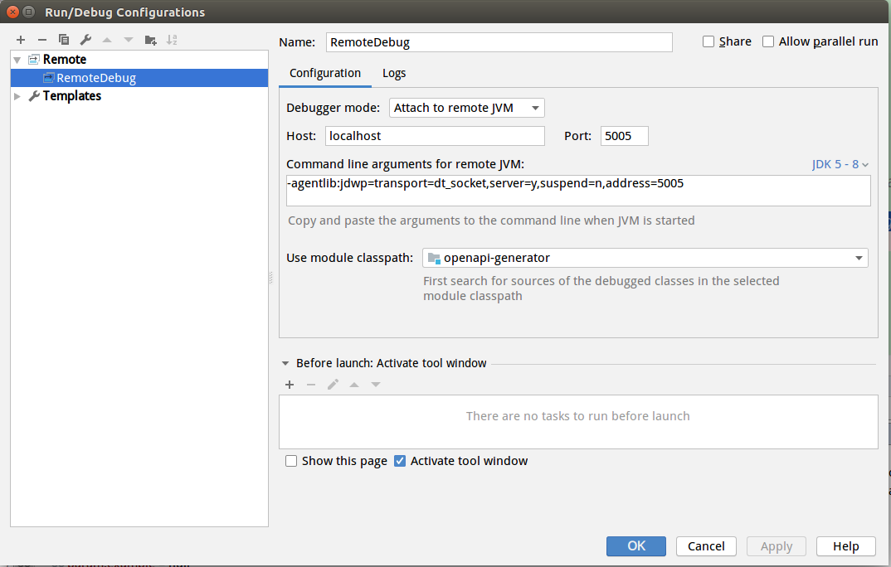

# OneAPI codegen for Rust

RustCodegen of OneAPI

## Overview

This codegen tool was forked from [OpenAPITools/openapi-generator](https://github.com/OpenAPITools/openapi-generator) project.
By using the [OpenAPI-Spec](https://github.com/OAI/OpenAPI-Specification) from a remote server,
you can easily generate a server stub and client code.

To see how to make this your own, look here:

[README]((https://openapi-generator.tech))

- API version: 2.0.0


This autogenerated project defines an API crate `xxx` which contains:
* An `Api` trait defining the API in Rust.
* Data types representing the underlying data model.
* A `Client` type which implements `Api` and issues HTTP requests for each operation.
* A router which accepts HTTP requests and invokes the appropriate `Api` method for each operation.

It also contains an example server and client which make use of `xxx`:

* The example server starts up a web server using the `xxx`
    router, and supplies a trivial implementation of `Api` which returns failure
    for every operation.
* The example client provides a CLI which lets you invoke
    any single operation on the `xxx` client by passing appropriate
    arguments on the command line.

You can use the example server and client as a basis for your own code.
See below for [more detail on implementing a server](#writing-a-server).

## Examples

Run examples with:

```
cargo run --example <example-name>
```

To pass in arguments to the examples, put them after `--`, for example:

```
cargo run --example client -- --help
```

### Running the example server
To run the server, follow these simple steps:

```
cargo run --example server
```

### Running the example client
To run a client, follow one of the following simple steps:

```
cargo run --example client <MethodName>
```

### HTTPS
The examples can be run in HTTPS mode by passing in the flag `--https`, for example:

```
cargo run --example server -- --https
```

This will use the keys/certificates from the examples directory. Note that the
server chain is signed with `CN=localhost`.

## Using the generated library

The generated library has a few optional features that can be activated through Cargo.

* `server`
    * This defaults to enabled and creates the basic skeleton of a server implementation based on hyper
    * To create the server stack you'll need to provide an implementation of the API trait to provide the server function.
* `client`
    * This defaults to enabled and creates the basic skeleton of a client implementation based on hyper
    * The constructed client implements the API trait by making remote API call.
* `conversions`
    * This defaults to disabled and creates extra derives on models to allow "transmogrification" between objects of structurally similar types.

See https://doc.rust-lang.org/cargo/reference/manifest.html#the-features-section for how to use features in your `Cargo.toml`.

## Documentation for API Endpoints

All URIs are relative to *http://localhost*

Method | HTTP request | Description
------------- | ------------- | -------------

## Debuging tool

https://openapi-generator.tech/docs/debugging

- execute mvn package to uopenapi-v3.yaml
pdate generator tool
./run-in-docker.sh mvn package

- Setting env JAVA_OPTS: 
export JAVA_OPTS="${JAVA_OPTS} -DdebugOpenAPI=true -DdebugModels=true -DdebugOperations=true -DdebugSupportingFiles=true -Dlog.level=debug";
export JAVA_OPTS="${JAVA_OPTS} -agentlib:jdwp=transport=dt_socket,server=y,suspend=y,address=5005";

- Run script from root path to generate code
one-api/rust-server-one-api.sh

- Remote Debug settingwith jetbrains idea


- Jetbrains idea add breakpoint and start RemoteDebug

- Stop debug, just run
    echo  $JAVA_OPTS
    unset JAVA_OPTS

## Debuging code
- Enable env_logger
export RUST_LOG=debug;
export RUST_LOG=info;
echo  $RUST_LOG

- Run Example
### Running the example server
To run the server, follow these simple steps:
```
cargo run --example server
```

### Running the example client
To run a client, follow one of the following simple steps:
```
cargo run --example client  <example-name>
```

To pass in arguments to the examples, put them after `--`, for example:
```
cargo run --example client BatchImport
```


